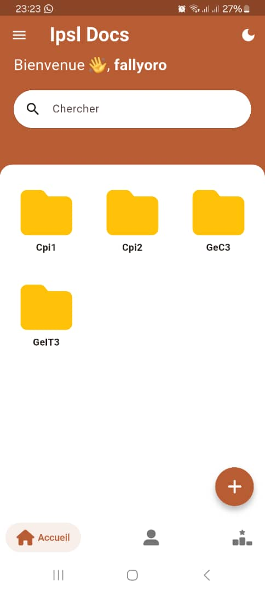
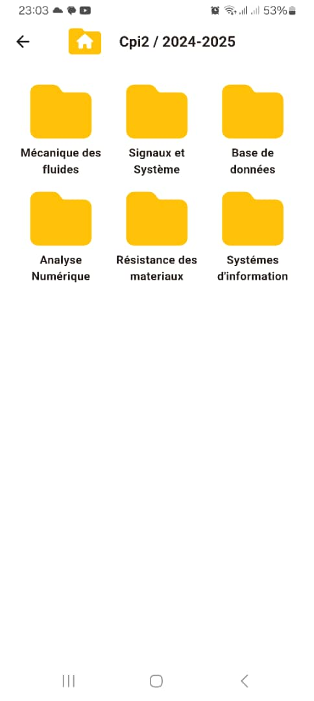
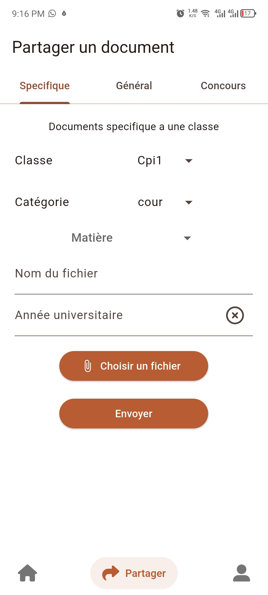

# 📚 Ipls_docs — Bibliothèque numérique multi‑plateformes

Ipls_docs est une **application Flutter** que j'ai developer pour l’Institut Polytechnique de Saint‑Louis. Elle permet l’accès à une bibliothèque numérique sur **Android** et **Linux** .

---

<p align="center">
  &nbsp;&nbsp;&nbsp;&nbsp;&nbsp;
  &nbsp;&nbsp;&nbsp;&nbsp;&nbsp;
  
</p>


## ✨ Fonctionnalités

- Navigation dans les collections (PDF, e‑books…)
- Recherche et consultation rapide
- Téléchargement pour lecture hors‑ligne
- Interface responsive (desktop & mobile)
- Authentification 

---

## 🚀 Installation


### 1. 👤 Pour les utilisateurs (installation simple)
- [Linux AppImage](https://github.com/fallyoro/ipsl_docs/blob/main/front/mobile/ipsl_docs/apps/ipsl_docs.zip?raw=true
)  
- [Android APK 64 bits](https://github.com/fallyoro/ipsl_docs/raw/main/front/mobile/ipsl_docs/apps/ipsl_docs64.apk
) 
- [Android APK 32 bits](https://github.com/fallyoro/ipsl_docs/raw/main/front/mobile/ipsl_docs/apps/ipsl_docs32.apk
)  


#### Linux (AppImage)
1. Télécharge le fichier `.AppImage`.
   
2. Decompresse le fichier
   ```bash
   unzip ipsl_docs.zip
4. Entre dans le dossier ipsl_docs :
   ```bash
   cd ipsl_docs
5. Lance ipsl_docs
   ```bash
   ./ipsl_docs

### 👨‍💻 Pour les développeurs (Flutter)
Prérequis
- Flutter SDK installé (version 3.29.3)

- Git

- IDE (VS Code, Android Studio…)


### 🛠️ Contribution
- Fork le repo

- Crée feature/... ou fix/...


- Consulte les Issues pour voir les priorités.

